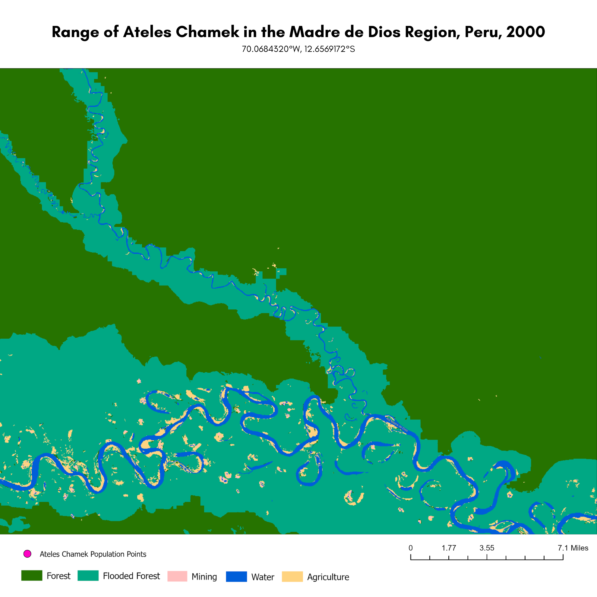
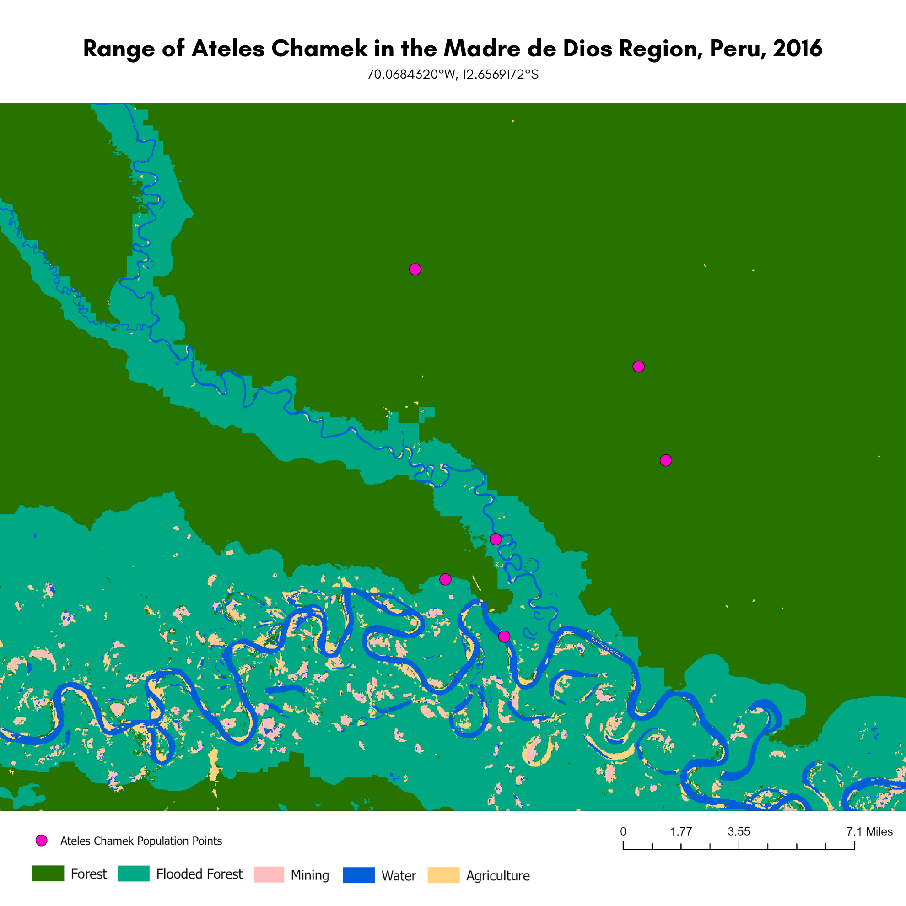
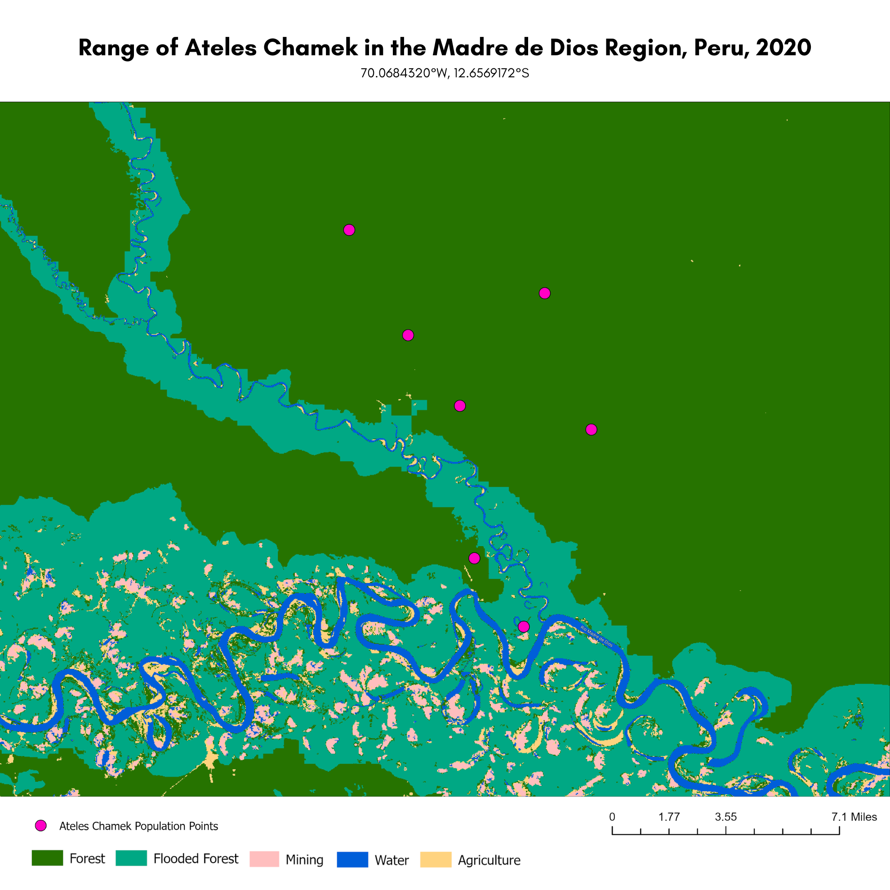
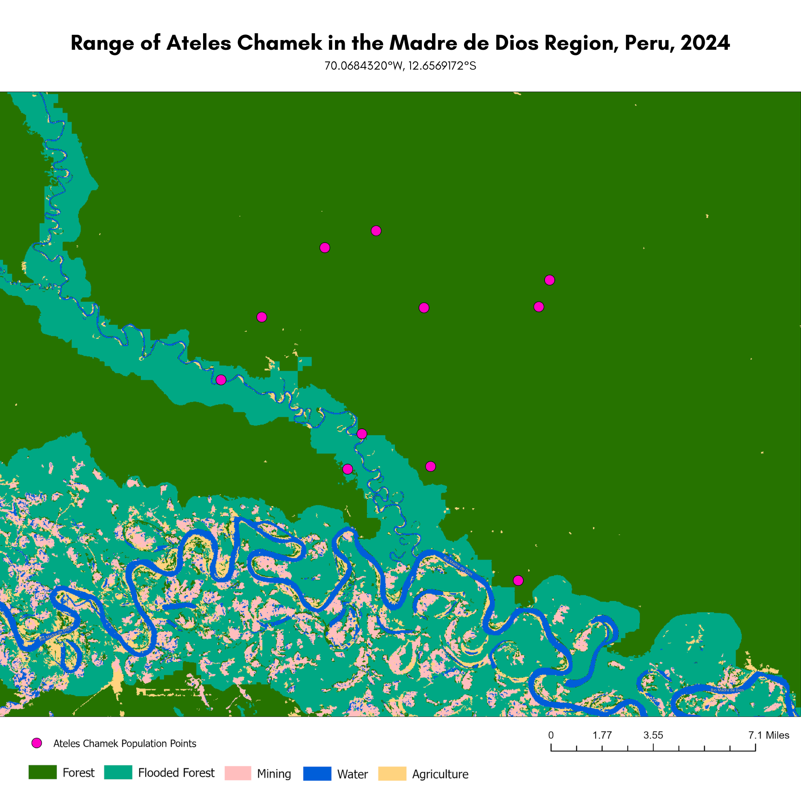

## Project Background
This project is a portfolio version of my undergraduate capstone research. For this repository, I've organized the documentation to demonstrate GIS analysis and cartographic techniques.

## Project Goals
The aim of this project was to examine land use and land cover change in the Madre de Dios region of Peru from 2000 to 2024; specifically, how deforestation and fragmentation from land use change has contributed to population changes among Ateles chamek (Peruvian black spider monkeys).

## Study Area and Subjects
Madre de Dios was chosen due to its biodiversity and representation of anthropogenic pressure within the Amazon rainforest basin. The region contains extensive tropical forest, but has experienced increasing pressure from agriculture, mining, and other infrastucture development. Ateles chamek was selected as a subject to study due to its endagered status on the IUNC Red List, and propensity for flooded-forest habitats with continuous canopy cover, which may be affected by land use change.

## Data Soruces & Methods
Land cover data for the years 2000, 2008, 2016, 2020, and 2024 were collected from MapBiomas Peru, and clipped to the study area within ArcGIS Pro. The data were symbolized to highlight major land use and cover classes, namely, Forest, Flooded Forest, Agriculture, Mining, and Water. GBIF.org was used to collect species occurence records for Ateles chamek, which were overlaid as population points within each temporal map. 

## Maps

### 2000

### 2008

### 2016

### 2020

### 2024

## Results
The analysis illustrates a notable increase in agricultural and mining land use across the specified study area at roughly 70.0684320°W, 12.6569172°S. Most of this land use change is seen along the Madre de Dios River and supporting tributaries. From 2000 to 2008, maps show an area dominated by forest and flooded forest, with agriculture appearing sparsely, primarily along the southern river margins. It is important to note that no verified Ateles chamek occurrence records were available for the study area in either year. This absence does not indicate that spider monkeys were absent from Madre de Dios. Rather, it is likely due to the limitations of pre-digital wildlife monitoring and reporting.

The documented monkey sightings from 2016 cluster in two zones: the interior forest to the north and northwest of the river, and one point near a transitional forest-agriculture section to the south. By 2020, seven occurrence points are present; mining zones are visibly larger in the southern portions of the map compared to 2016, and the river is increasingly bordered by disturbed land-cover. The population points, meanwhile, are concentrated in the central and northern forest interior, away from the most disturbed zones. 

In 2024, ten Ateles chamek observations are documented, the highest count in the dataset. The majority cluster in the northern and central interior forest areas, where forest cover remains most intact. Meanwhile, the southern portions of the map show substantial expansion of mining and agricultural land use relative to earlier years. The agricultural and mining boundaries have moved northward. 

While no causal statistical analysis was performed, the correlation between degraded land-cover expansion and the northward displacement of Ateles chamek sightings is visually clear. As mining and agricultural activity have increased in the southern river corridor, the documented range of the species appears to have shifted toward remaining areas of intact interior forest. 

## References: Supporting Literature & Data 

Animal Diversity Web. (n.d.). Ateles chamek (Chamek spider monkey). Regents of the University of Michigan. https://animaldiversity.org/accounts/Ateles_chamek/

Asner, G. P., Llactayo, W., Tupayachi, R., & Luna, E. R. (2013). Elevated rates of gold mining in the Amazon revealed through high-resolution monitoring. Proceedings of the National Academy of Sciences,     110(46), 18454–18459. https://doi.org/10.1073/pnas.1318271110

Fahrig, L. (2003). Effects of habitat fragmentation on biodiversity. Annual Review of Ecology, Evolution, and Systematics, 34, 487–515. https://doi.org/10.1146/annurev.ecolsys.34.011802.132419

Global Biodiversity Information Facility. (n.d.). Ateles chamek species occurrence database 1913–2026. https://www.gbif.org/species/2436646

International Union for Conservation of Nature. (2021). Ateles chamek. The IUCN Red List of Threatened Species, 2021(3). https://www.iucnredlist.org/species/41547/191685783

Jungle Keepers (n.d.). https://www.junglekeepers.org/

MapBiomas Project Peru. (n.d.). MapBiomas: Land cover and land use maps for Peru 1985–2024. https://peru.mapbiomas.org

Rabelo, R. M., Silva, F. E., Vieira, T., Ferreira-Ferreira, J., Paim, F. P., Dutra, W., de Souza e Silva Júnior, J., & Valsecchi, J. (2014). Extension of the geographic range of Ateles chamek (Primates, Atelidae): Evidence of river-barrier crossing by an Amazonian primate. Primates, 55(2), 167–171. https://doi.org/10.1007/s10329-013-0401-3

Rabelo, R. M., Gonçalves, J. R., Silva, F. E., Vieira, T., Ferreira-Ferreira, J., Paim, F. P., & Valsecchi, J. (2020). Predicted distribution and habitat loss for the endangered black-faced black spider monkey (Ateles chamek) in the Amazon. Oryx, 54(5), 699–705. https://doi.org/10.1017/S0030605318000522

Rojas, N., & Prieto, R. (Eds.). (2010). Amazon basin: Plant life, wildlife and environment. Environmental Research Advances Series.

Spence, K. (n.d.). Tropical rainforests: Earth’s richest ecosystems. Natural History Museum. https://www.nhm.ac.uk/discover/tropical-rainforests.html

Trejo, P., Azevedo-Ramos, C., & Lenti, F. (2025). Forest fragmentation in the Brazilian Amazon: Trends and conservation strategies. Perspectives in Ecology and Conservation, 23, 104–109. https://doi.org/10.1016/j.pecon.2025.04.001

Wallace, R. B. (2008). Factors influencing spider monkey habitat use and ranging patterns. In C. J. Campbell (Ed.), Spider monkeys: Behavior, ecology and evolution of the genus Ateles (pp.138–154). Cambridge University Press. https://doi.org/10.1017/CBO9780511721915.005

Zou, Y., et al. (2025). Fragmentation increased in over half of global forests from 2000 to 2020. Science, 389, 1151–1156. https://doi.org/10.1126/science.adr6450
